# Практическое задание по теме "`Docker-compose`" - `Белов Михаил`

## Блок 1: "Классический LAMP/LEMP" (Основа)

### Задание 1: Связка Wordpress + MySQL (Порядок запуска)

1. Напиши docker-compose.yml (версии 3.8+) с двумя сервисами:

- `db`: образ `mysql:8.0`. Задай корневой пароль через переменную окружения (пусть берется из файла `.env`).

- `wordpress`: образ `wordpress:latest`. Пробрось порт `8080:80`.

- Используй `depends_on`.

[Файл docker-compose с настройкой контейнеров](./docker-compose-wp.yml)

`При входе на Web-страницу Wordpress в поле "Сервер БД" необходимо указать имя контейнера, то есть "db" (работает DNS внутри Docker)`

2. Запусти стек. Дождись логов MySQL (ready for connections).

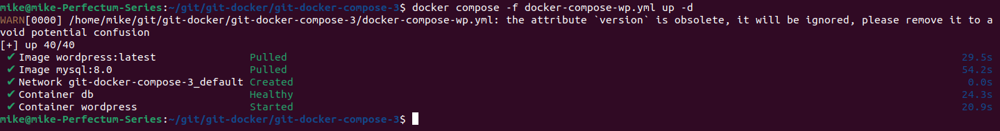

3. **Вопрос**: `depends_on` ожидает статуса Up (контейнер стартовал), но не готовности сервиса. Что нужно добавить в конфигурацию (healthcheck) и в depends_on, чтобы WordPress реально ждал, пока MySQL начнет принимать подключения, а не просто запустит процесс mysqld?

`Для контейнера db следует добавить healthcheck:`
```
healthcheck:
      test: ["CMD", "mysqladmin", "ping", "-h", "localhost", "-u", "root", "-p$${MYSQL_ROOT_PASSWORD}"]
      interval: 10s
      timeout: 5s
      retries: 3
```
`Для Wordpress нужно добавить:`
```
depends_on:
      db:
        condition: service_healthy
```

### Задание 2: Микросервисы и Сети (Backend vs Frontend)

Изоляция трафика

1. Создай `docker-compose.yml` с приложением для голосования (можно использовать образы `ealen/echo-server` для имитации сервисов):

- redis (бэкенд).
- worker (бэкенд).
- vote-ui (веб-интерфейс).
- result (веб-интерфейс для просмотра результатов)
- db (база данных)

[Файл создания контейнеров приложения для голосования](./docker-compose-vote.yml)

2. Создай две сети: `front_net` и `back_net`.
3. Подключи `redis` и `worker` только к `back_net`.
4. Подключи `vote-ui` к `back_net` и `front_net`.
5. **Вопрос**: Зачем UI-сервису доступ в обе сети? Объясни безопасность такого подхода. Можно ли просто посадить все в одну сеть по умолчанию?

`Зачем UI-сервису доступ в обе сети?`

`- frontend — чтобы принимать запросы от пользователей (порт 5000/5001)`

`- backend — чтобы общаться с redis (vote) или db (result)`

`Можно ли посадить всё в одну сеть по умолчанию?`

`Технически да, но тогда:`

`- Нет изоляции между пользовательским трафиком и внутренним`

`- redis и db становятся доступны извне (при ошибке конфигурации портов)`

`- Нарушается принцип минимальных привилегий`

`Разделение на frontend и backend — это стандартная практика безопасности.`

---

## Блок 2: Переменные, Конфигурации и Переопределение

### Задание 3: Приоритет переменных окружения (Отладка)

1. Создай в директории проекта файл .env:
```
MY_PASS=from_env_file
```
[Файл .env](./.env)

2. Создай файл db.env:
```
MY_PASS=from_db_env_file
```
[Файл db.env](db.env)

3. Напиши docker-compose.yml:
```
services:
  tester:
    image: alpine:3.19
    command: sh -c "echo Password is: $MY_PASS"
    environment:
      - MY_PASS=from_compose_env
    env_file:
      - ./db.env
```
4. Запусти стек командой:
```
MY_PASS=from_shell docker compose -f docker-compose-env.yml up
```
5. Контейнер отработает и завершится.

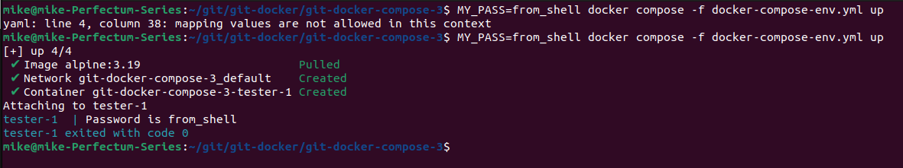

**Вопрос**: Какое значение переменной MY_PASS будет выведено в логах и почему именно оно?

`Приоритеты применения переменных (от высшего к низшему):`

`1. Переменная переданная через командную строку при старте контейнера`

`2. Переменная заданная в файле .env`

`3. Переменная указанная непосредственно в docker-compose файле`

`4. Переменная указанная в файле db.env`

---

### Задание 4: YAML Anchors (DRY — Don't Repeat Yourself)

Используй механизм якорей (& и <<: *) для сокращения дублирования.

**Исходные данные**:

Создай `docker-compose.yml` с тремя сервисами **nginx** (используй образ `nginx:alpine`), у которых должны быть одинаковые:

- Лимиты ресурсов: `cpus: 0.5`, `memory: 128M`
- Настройки логирования: драйвер `json-file`, максимум размера файла `10m`, максимум файлов `3`

**Требования**:

1. Три сервиса назови `web1`, `web2`, `web3`. Для каждого укажи свой порт наружу: `8081:80`, `8082:80`, `8083:80`.
2. Общие настройки (`resources` и `logging`) опиши один раз в корне файла как YAML-якоря и примени ко всем трём сервисам через `<<: [*limits, *logging]`.

[Файл настройки сервисов с использованием якорей](./docker-compose-nginx.yml)

3. Выполни `docker compose -f docker-compose-nginx.yml config` — убедись, что в выводе нет дублирования, настройки "развернулись" для каждого сервиса.

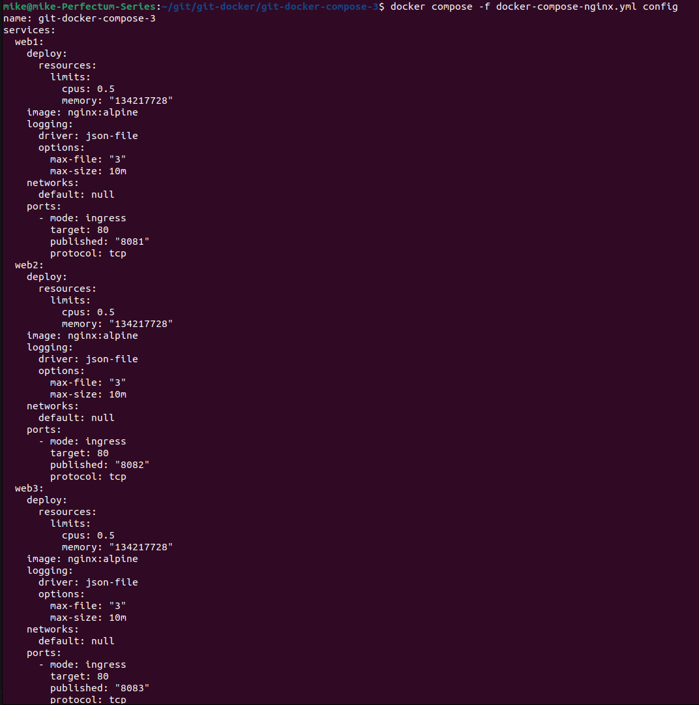

---

## Блок 3: Данные и Инженерия

### Задание 5: Анонимные и Именованные тома

Пойми разницу в жизненном цикле томов.

**Исходные данные:**

```
services:
  writer:
    image: alpine:3.19
    command: sh -c 'while true; do date >> /data/dates.txt; sleep 5; done'
    volumes:
      - /data   # ← анонимный том
```

1. Запусти стек: `docker compose up -d`
2. Подожди 15 секунд, проверь, что данные пишутся: `docker compose -f docker-compose-vol.yml exec writer cat /data/dates.txt`

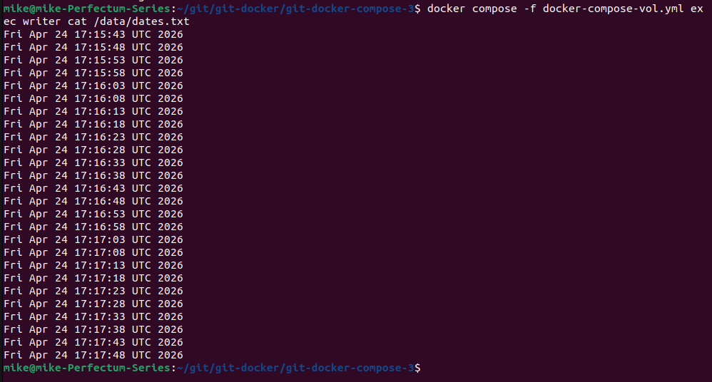

3. Останови и удали стек: `docker compose down` (флаг -v НЕ используй — иначе удалятся и анонимные тома)
4. Найди анонимный том на хосте: `docker volume ls` (длинное имя-хэш). Запомни его.

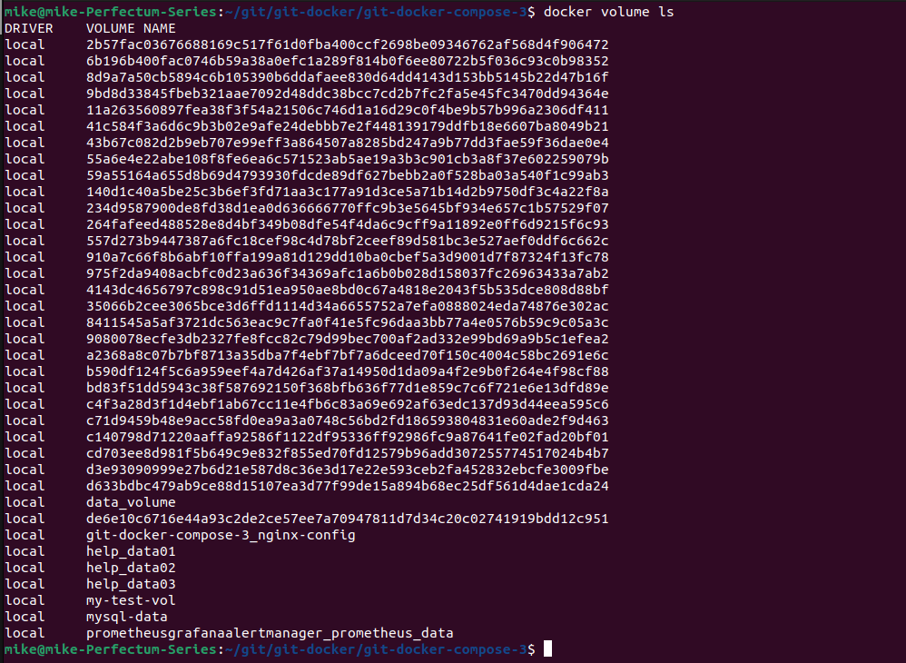

5. Снова запусти стек: `docker compose -f docker-compose-vol.yml up -d`. Проверь данные: `docker compose exec writer cat /data/dates.txt`. Сохранились ли старые данные?

`Данные не сохранились:`

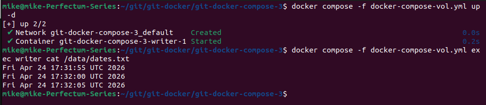

6. Останови стек, удали анонимный том вручную: `docker volume rm <хэш>`
```
docker volume prune
```
7. Перепиши docker-compose.yml на именованный том `writer_data` (опиши его в секции `volumes` верхнего уровня).
```
volumes:
  - ./writer_data:/data
```
8. Повтори шаги 1-5. После `docker compose down` проверь: `docker volume ls`. Остался ли `writer_data`? Снова запусти стек — данные наместе?

`Именованный том не отображается:`
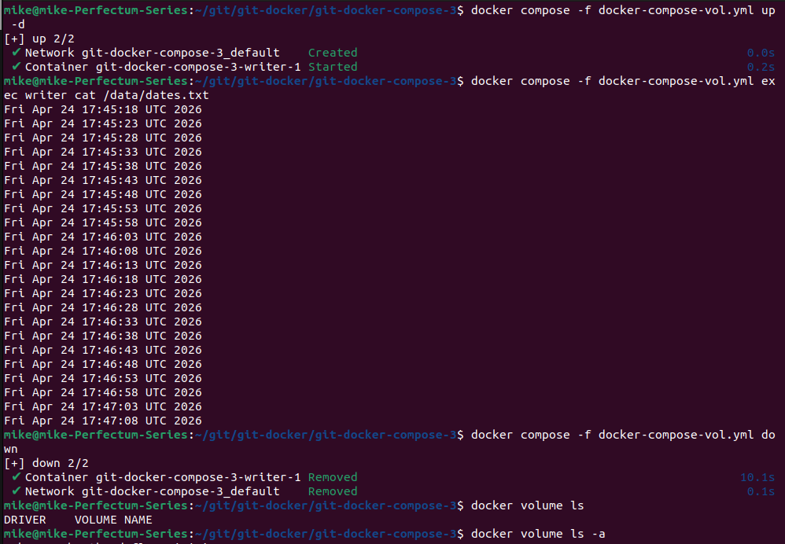

`Данные на месте:`
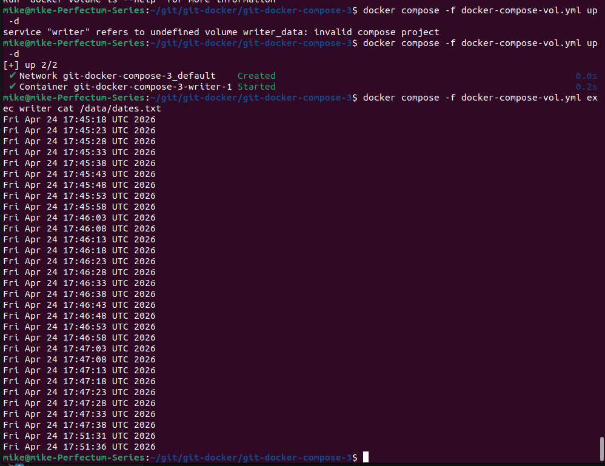

**Вопрос**: Почему анонимные тома трудно отслеживать и легко потерять (особенно при `docker compose down -v`), а именованные — нет? Какой том выбрать для базы данных в продакшене?

`Анонимные тома для идентификации имеют неудобочитаемый ID`

`При удалении контейнера удаляется и том`

`Исходя из вышесказанного, для продакшен лучше подходит именованные тома`

---

### Задание 6: Перезапись ENTRYPOINT и CMD в Compose

Изучи разницу между переопределением `entrypoint` и `command`.

**Исходные данные:**

Напиши отдельный Dockerfile:
```
FROM alpine:3.19
ENTRYPOINT ["echo", "Hello"]
CMD ["World"]
```
**Порядок действий:**

1. Собери образ с тегом `greeter:latest`:
```
docker build -t greeter:latest .
```
2. Создай `docker-compose-greeter.yml`:
```
services:
  greeter:
    image: greeter:latest
```
3. Запусти: `docker compose -f docker-compose-greeter.yml up`. Что вывелось?

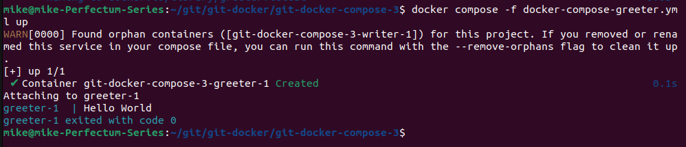

4. Переопредели `CMD` прямо в compose-файле, чтобы выводилось твоё имя:
```
command: ["Mike"]
```
5. Запусти снова. Что вывелось? Почему `CMD` дополнил `ENTRYPOINT`, а не заменил его полностью?

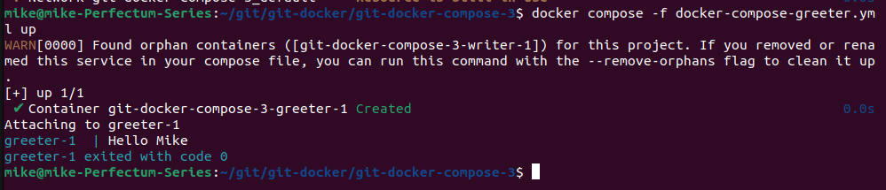

`Аргументы CMD можно переопределять при запуске контейнера. Аргументы ENTRYPOINT переопределять нельзя. При запуске контейнера новые аргументы добавляются к существующим`

6. Теперь переопредели ENTRYPOINT в compose-файле, чтобы запускался sleep 3600, а command убери:
```
entrypoint: ["sleep"]
command: ["3600"]
```
7. Запусти, проверь через docker compose ps, что контейнер работает.
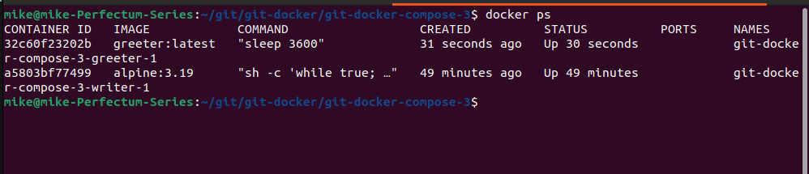

`Тут разница не ясна. Аргумент Entrypoint тоже успешно переопределился...`

8. Теперь полностью переопредели `entrypoint` одной строкой:
```
entrypoint: ["sleep", "9999"]
```
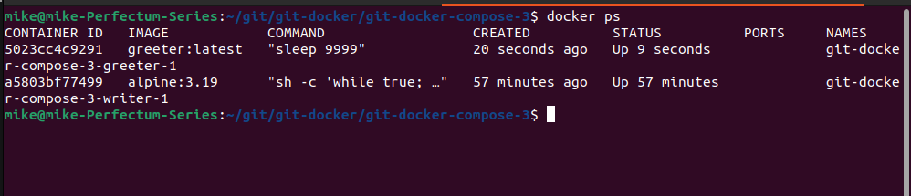

**Вопрос**: Почему при переопределении `entrypoint` через `["sleep"]` нам всё ещё нужен `command` для передачи аргумента, а при `["sleep", "9999"]` — уже нет? В чём разница между `CMD` и `ENTRYPOINT` с точки зрения Docker?

`CMD может выступать в качестве аргументов для ENTRYPOINT`

---

## Блок 4: Production Readiness (Senior)

### Задание 7: Управление ресурсами — Limits vs Reservations

**Исходные данные:**

Сервис `stress` на основе образа `polinux/stress:latest`.

**Требования:**

1. Напиши `docker-compose-stress.yml`:

[Файл docker-compose-stress.yml](./docker-compose-stress.yml)

2. Запусти стек: `docker compose -f docker-compose-stress.yml up -d`
3. Смотри потребление памяти: `docker stats`

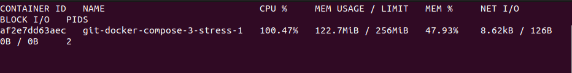

4. Через 2 минуты контейнер сам завершится (timeout).

**Вопросы:**

**Ситуация 1:** Контейнер потребляет 40 МБ памяти (меньше обоих значений). Будет ли OOM-killer на хосте его убивать, если свободная память закончится?

`Да, будет. Значение Reservation предназначено для резервирования памяти (в помощь scheduller) - нижняя граница. Limits задает жесткие лимиты использования ресурса - верхняя. OOM отреагирует на закончившуюся память в любом случае`

**Ситуация 2:** Контейнер потребляет 200 МБ (больше reservations, но меньше limits). Будет ли OOM-killer его убивать? Может ли он занять 200 МБ, если reservations всего 50 МБ?

`Из вышеуказанного ответа следует, что OOM не будет убивать этот процесс пока он не достигнет значения limits или пока память не закончится`

Объясни, в чём разница между limits (жёсткий потолок) и reservations (помощь планировщику)? Кто именно использует reservations при размещении контейнеров в кластере (Swarm/Kubernetes)?

`На первый вопрос ответ был дан выше.`

`Практически все современные оркестраторы используют лимиты при развертывании контейнеров`

---

### Задание 8: Healthcheck в Compose (Наблюдаемость)

**Исходные данные:**

Сервис `web` на основе `nginx:alpine`. В этом образе нет `curl`, поэтому healthcheck будем делать через встроенную утилиту `wget` (она есть в `nginx:alpine`).

**Требования:**

1. Напиши `docker-compose-hc.yml`:

[Файл docker-compose-hc.yml](docker-compose-hc.yml)

2. Запусти стек: `docker compose -f docker-compose-hc.yml up -d`
3. Проверь статус: `docker ps` — должен быть `healthy`:

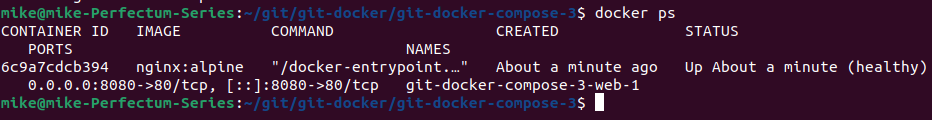

4. Зайди в контейнер и **убей** nginx:
```
docker compose exec web sh -c 'pkill nginx'
```
5. Сразу же проверь статус: `docker ps` — что в столбце STATUS? 

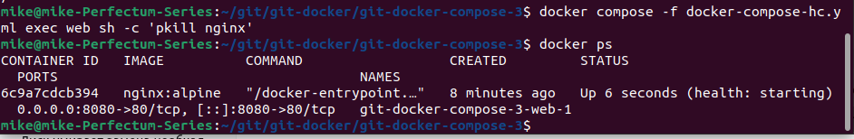

6. Подожди 15-20 секунд, снова проверь `docker ps`. Что произошло с контейнером? Перезапустился ли он благодаря `restart: unless-stopped`?

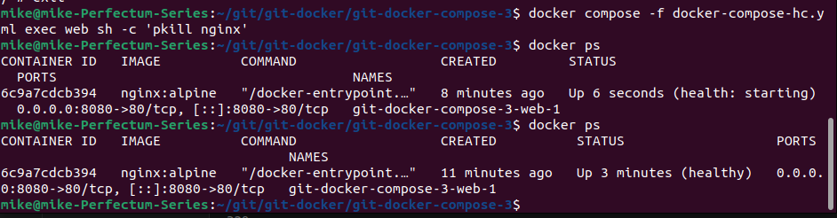

**Вопрос:** Почему healthcheck не предотвращает падение контейнера, а только констатирует факт? 

`Healthcheck создан для определения статуса контейнера, а не для траблшутинга`

Кто именно (Docker daemon или оркестратор) принимает решение о перезапуске на основе healthcheck?

`Docker daemon принимает решение о перезапуске сервиса на основе ключа restart`

---

### Задание 9: Секреты в Compose (Безопасность)

**Исходные данные:**

Секреты в Docker Compose (не путать с `--mount=type=secret` из BuildKit) — это механизм передачи **файлов** с чувствительными данными внутрь контейнера без использования переменных окружения.

**Требования:**

1. Создай файл `mysql_root_password.txt`:
```
SuperSecretRoot123
```
2. Напиши `docker-compose.yml`:

[docker-compose-secrets.yml](./docker-compose-secrets.yml)

3. Запусти стек: `docker compose -f docker-compose-secrets.yml up -d`
4. Проверь, что файл с паролем примонтирован внутрь контейнера:
```
docker compose exec db cat /run/secrets/db_root_password
```
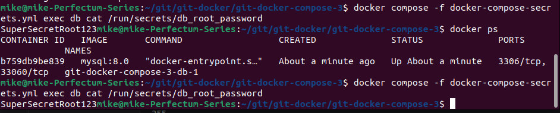

5. Проверь, что MySQL запустился и принял пароль:
```
docker compose exec db mysqladmin ping -u root -pSuperSecretRoot123
```
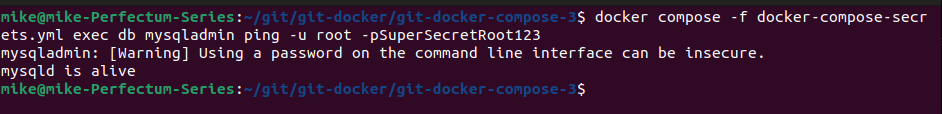

6. Останови и удали стек: `docker compose down`

**Вопросы:**

- Где физически на хосте хранится файл `mysql_root_password.txt` во время работы стека?

`/run/secrets/ внутри контейнера — это tmpfs, а исходный файл лежит в директории проекта.`

- В чём принципиальная разница между `secrets` (файл монтируется внутрь) и `environment: MYSQL_ROOT_PASSWORD=...` (значение в переменной окружения) с точки зрения утечки через `docker inspect`?

`С помощью docker inspect можно увидеть значение переменной environment: MYSQL_ROOT_PASSWORD в отличии от содержания файла примонтированного внутрь контейнера`

- Почему `MYSQL_ROOT_PASSWORD_FILE` безопаснее, чем `MYSQL_ROOT_PASSWORD`?

`См. ответ на предыдущий вопрос`

---

### Задание 10: Multiple Compose Files — Override (Dev vs Prod)

Админская реальность: базовый конфиг для разработки, отдельный оверлей для продакшена.

**Исходные данные:**

Файл `docker-compose.dev.yml` (base):
```
services:
  web:
    image: nginx:alpine
    ports:
      - "80:80"
    volumes:
      - ./html:/usr/share/nginx/html
```
Файл `docker-compose.prod.yml` (override):
```
services:
  web:
    image: nginx:stable                      # другой тег (стабильная версия)
    ports:
      - "443:443"                            # добавляем HTTPS
    volumes:
      - /mnt/nfs/html:/usr/share/nginx/html  # переопределяем путь на NFS
    deploy:
      resources:
        limits:
          memory: 256M
        reservations:
          memory: 128M
```
**Требования:**

1. Создай оба файла в одной директории.

2. Создай локальную тестовую страницу: 
```
mkdir html && echo "Dev" > html/index.html
```
3. Запусти базовый конфиг: `docker compose -f docker-compose.dev.yml up -d`
4. Проверь: 
```
curl http://localhost   # должно быть "Dev"
```
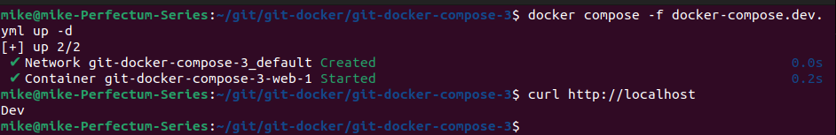

5. Останови: 
```
docker compose -f docker-compose.dev.yml down
```
6. Теперь запусти с оверлеем: 
```
docker compose -f docker-compose.dev.yml -f docker-compose.prod.yml up -d
```
7. Выполни `docker compose -f docker-compose.dev.yml -f docker-compose.prod.yml config` — посмотри, как смержились настройки.

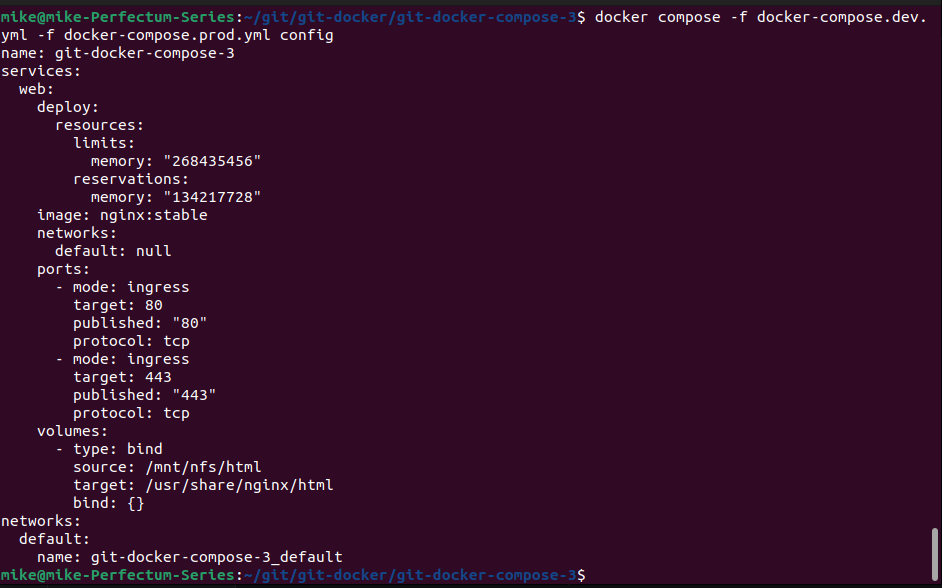

**Вопросы:**

- Что произошло со значением `ports`? Смержились списки (добавился 443 к 80) или перезаписались?

`Merge списков`

- Что произошло со значением `volumes`? Это список или словарь с точки зрения YAML? Почему путь заменился, а не добавился?

`volumes перезаписался`

`volumes - это словарь`

`volumes перезаписался из-за свойств словаря`

- Что произошло с image (был alpine, стал stable)? Это значение заменилось или смержилось?

`Значение изменилось. Возможно из-за того, что является словарем`

- Почему в продакшене опасно использовать `latest` и лучше явно указывать тег (как в оверлее `nginx:stable`)?

`Под тэгом latest может скрываться любая версия, которая не гарантирует корректной работы приложения. Необхлдимо указывать конкретную версию образа`
